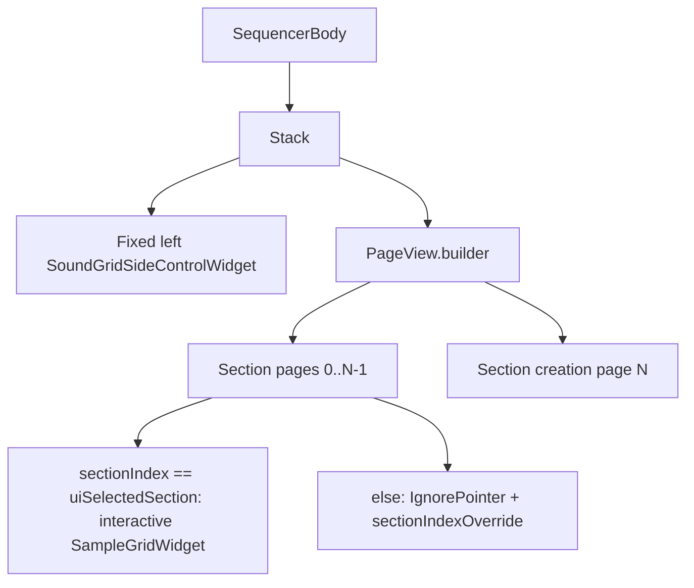

# Sections: playback, UI, swipe, and native navigation

Single reference for **section modes**, **horizontal swipe navigation**, **Flutter vs native alignment**, and **risks**. For table/native seqlock details see [native state sync pattern](../../native_state_sync_pattern.md). For vertical scroll inside the grid see [position retained scrolling](../position_retained_scrolling.md).

---

## Table of contents

1. [Overview](#1-overview)
2. [Playback modes](#2-playback-modes)
3. [UI components and overlays](#3-ui-components-and-overlays)
4. [Horizontal swipe and PageView](#4-horizontal-swipe-and-pageview)
5. [Three “current section” concepts](#5-three-current-section-concepts)
6. [UI navigation flow](#6-ui-navigation-flow)
7. [Native table and playback](#7-native-table-and-playback)
8. [Sync: native → Flutter](#8-sync-native--flutter)
9. [Flutter state (authoritative code)](#9-flutter-state-authoritative-code)
10. [Key behaviors](#10-key-behaviors)
11. [Strengths and weak spots](#11-strengths-and-weak-spots)
12. [Testing and future work](#12-testing-and-future-work)
13. [Code map](#13-code-map)

---

## 1. Overview

**Sections** are parts of a song that can be looped independently (**loop mode**) or chained (**song mode**). Each section has its own sound grid layers. Implementation lives in `SequencerBody` (horizontal paging), `TableState` (section indices, cell ranges, FFI table), and `PlaybackState` (transport, `current_section`).

---

## 2. Playback modes

### Loop mode (default)

- **Behavior:** The current section repeats.
- **Native:** Playback wraps within the playback region `[start, end)` (end exclusive). Flutter sets the region to the visible section window: `[sectionStart, sectionStart + gridRows)`.
- **Visual:** Loop control highlighted (accent).
- **End:** Does not stop on its own.

### Song mode

- **Behavior:** Sections play in order according to per-section loop counts, then advance.
- **Native:** Continuous playback over a larger region; Flutter can set region to `[0, stepsLen)`; engine stops when `current_step` reaches region end (see native sources for exact policy).
- **Visual:** Loop control dimmed.
- **End:** Stops after the last section completes.
- **UI:** Section display can follow playback (see [sync](#8-sync-native--flutter)).

---

## 3. UI components and overlays

### Section control (left side)

- **Section number:** Driven by **`TableState.uiSelectedSection + 1`** in `SoundGridSideControlWidget` (not necessarily `PlaybackState.currentSection` when stopped).
- **Loop / song:** Toggles mode; affects native immediately.
- **Arrows:** Previous section; **next** either moves to the next section or, on the **last** section, opens the **section creation** affordance (`SectionSettingsState.openSectionCreationOverlay()`).

### Section control overlay

- Lists sections, loop counts (e.g. 1–16), mode. Uses **`playbackState.currentSection`** in places for loop UI tied to transport.

### Section creation

- **Page:** Last **`PageView`** page is `SectionCreationOverlay` (blank or copy-from).
- **Flag:** `SectionSettingsState.isSectionCreationOpen` can be set from the chevron without moving the pager; programmatic pager sync is **blocked** while this flag is true.

---

## 4. Horizontal swipe and PageView

### Goals (UX)

- Swipe left/right between sections; adjacent sections visible while dragging.
- One extra page past the last section for **create**.
- Same `SampleGridWidget` for active and preview; previews use `IgnorePointer` + `sectionIndexOverride`.
- Vertical scroll and grid gestures stay usable on the active page.

### Layout

- **`Stack`:** Full-width `PageView` below; **fixed** left `SoundGridSideControlWidget` on top.
- **Proportions (typical):** ~8% left control, ~89% grid column, ~3% right gutter (`SequencerBody` constants).

### Architecture (mermaid)

### Preview vs active

- **Active:** `sectionIndex == tableState.uiSelectedSection` → `const SampleGridWidget()`.
- **Preview:** `SampleGridWidget(sectionIndexOverride: sectionIndex)` under `IgnorePointer`.

### Implementation notes

- **`itemCount: sectionsCount + 1`** (creation page).
- **`ValueKey(sectionsCount)`** on `PageView` rebuilds the pager when section count changes (watch for stateful subtree / controller interaction).
- **`onPageChanged`:** For `index < sectionsCount`, calls `playbackState.switchToSection(index)` and post-frame `setUiSelectedSection(index)`. Landing on the creation page does **not** change `uiSelectedSection`.

---

## 5. Three “current section” concepts

| Concept | Location | Role |
|--------|----------|------|
| **UI selected section** | `TableState._uiSelectedSection` | Editing target; `getSectionStartStep`, layers, visible cell sync. |
| **Native playback section** | `PlaybackState._currentSection` (native `current_section`) | Engine: loops, song advance, SunVox timeline. |
| **PageView page** | `PageController` | Visible page; indices `0…sectionsCount-1` are sections; `sectionsCount` is creation. |

**Desired:** Visible page index matches `uiSelectedSection` while editing; after append/play, native `current_section` matches when required.

---

## 6. UI navigation flow

### Pager vs `uiSelectedSection`

Programmatic updates (`appendSection`, import, `setUiSelectedSection`) do not move the `PageView` by themselves. **`SequencerBody`** keeps the controller aligned via:

- Listeners on **`TableState`** when `sectionsCount` or `uiSelectedSection` changes.
- Listener on **`SectionSettingsState`** (e.g. creation overlay closed without another table notify).
- **Post-frame** `jumpToPage` (not during `build`), guarded by:

  - not user-scrolling,
  - not `isSectionCreationOpen`,
  - not in the fractional gap “toward creation” between last section and creation page.

### Chevron vs swipe

Opening creation via the **next** chevron sets **`isSectionCreationOpen`** but does **not** scroll to the creation **page**; the full create UI is the last **PageView** child. Users may need to **swipe** to that page to tap “Create new section,” unless another entry path exists.

---

## 7. Native table and playback

### Table (`table.h`, `TableState`)

- Sections are **contiguous absolute step ranges** in one table (`start_step`, `num_steps`, `sections_count`, `sections_ptr`).
- **Append / delete / reorder** mutate native layout; Dart mirrors via **`syncTableState()`** (seqlock).

### Playback FFI

- **`PlaybackState.switchToSection`:** seamless song mode while **playing**; otherwise immediate.
- **`start()`:** When not already playing, uses **`uiSelectedSection`** so Play starts in the section being edited (after `switchToSection`).
- **`appendSection`:** After sync, selects the new section and calls **`switchToSectionImmediate`** on playback FFI so native current section matches the new UI selection.

### Region / metadata (conceptual)

Native code uses a **playback region** and mode flags; some `set_current_section`-style APIs may update **metadata** while transport follows region and step. Treat **table + playback bindings** as source of truth for current behavior.

---

## 8. Sync: native → Flutter

**`syncPlaybackState`:** Updates `PlaybackState` from native. When **`songMode && isPlaying`**, a change in native **`current_section`** also calls **`tableState.setUiSelectedSection`** so the editor follows the playing section.

When **stopped**, playback sync does **not** overwrite **`uiSelectedSection`**, so the grid can show a different section than native `current_section` until **`switchToSection`** runs.

---

## 9. Flutter state (authoritative code)

The live app uses **`TableState`** (native-backed cells, `uiSelectedSection`, `sectionsCount`) and **`PlaybackState`**, not the older `Map<int, List<...>>` / `_currentSectionIndex` sketches from early docs.

- **Grid data:** Native table + `getCellNotifier` / `readCell` by absolute step.
- **Section switching:** Update **`uiSelectedSection`** and native playback via **`switchToSection`** / **`appendSection`** as described above.

---

## 10. Key behaviors

- **Manual navigation:** Arrows and swipe update **`uiSelectedSection`** and call **`switchToSection`** on settle.
- **Song playback:** UI can follow engine when playing in song mode (see §8).
- **Creation:** Append must **`syncTableState`** so **`sectionsCount`** matches native before the pager rebuilds; close creation overlay when a section is created so pager sync is not blocked.
- **Auto-save / threads:** See project auto-save and pattern docs.

---

## 11. Strengths and weak spots

### Strengths

- Table vs playback separation; PageView gives clear gestures; post-frame pager sync avoids build-time jumps; song mode can drive UI from engine.

### Weak spots

1. **Triple source of truth:** `uiSelectedSection`, `PageController` page, native `current_section` can diverge (blocked sync, scroll state, or stopped playback).
2. **Immediate vs seamless:** **`appendSection`** uses **immediate** FFI; **`PlaybackState.switchToSection`** uses seamless when **song + playing**—append-while-playing could need aligned behavior.
3. **Mixed widgets:** Some UIs use **`currentSection`**, others **`uiSelectedSection`**—confusing when stopped.
4. **Creation:** Overlay flag vs creation **page** mismatch (chevron).
5. **Listener scope:** Pager sync only tracks section count / `uiSelectedSection` / section settings—not every `TableState` change.
6. **Seqlock:** Rare missed `syncTableState` can delay count until next tick ([native_state_sync_pattern.md](../../native_state_sync_pattern.md)).
7. **`ValueKey(sectionsCount)`:** Full pager subtree reset on count change.
8. **`onPageChanged`:** Post-frame `setUiSelectedSection`; rapid swipes are usually OK.

---

## 12. Testing and future work

**Manual scenarios:** Swipe between sections; swipe to creation; create blank and copy-from; single section; rapid swipes; change data while swiping; overlay + pager consistency.

**Possible enhancements:** Stronger creation entry (auto `animateToPage` to creation), unified “current section” label policy, keyboard navigation, thumbnails.

---

## 13. Code map

| Area | Files |
|------|--------|
| PageView + sync | `app/lib/widgets/sequencer/v1/sequencer_body.dart` |
| Table / append / sync | `app/lib/state/sequencer/table.dart` |
| Playback | `app/lib/state/sequencer/playback.dart` |
| Creation overlay flag | `app/lib/state/sequencer/section_settings.dart` |
| Side control | `app/lib/widgets/sequencer/v1/sound_grid_side_control_widget.dart` |
| Creation UI | `app/lib/widgets/sequencer/v1/section_creation_overlay.dart` |
| Native table | `app/native/table.h` |
| SunVox / playback bridge | `app/native/sunvox_wrapper.h` and related sources |

---

## Related documentation

- [Native state sync pattern](../../native_state_sync_pattern.md)
- [Position retained scrolling](../position_retained_scrolling.md)
- [Patterns / draft and switching](../patterns_draft_and_switching.md) (if applicable to your workflow)
