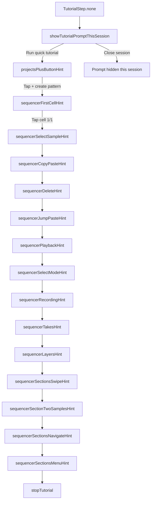
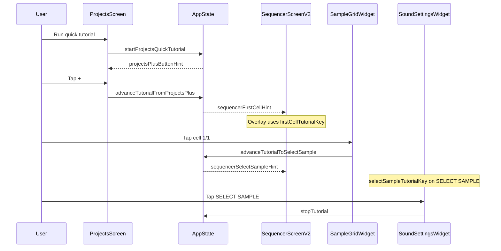

# First-launch tutorial flow

This document describes the in-app **quick tutorial** flow, current step order, and implementation map.

## Current status

- Tutorial runtime is controlled by internal flag `TutorialService.isEnabled` in `app/lib/services/tutorial_service.dart`.
- Tutorial overlays now show **label + counter + Back** (no Next button).
- Related tutorial actions are merged under shared step labels.

## Purpose (when enabled)

- On the **first app session** (persisted flag), show a prompt to **Run quick tutorial** with dismiss.
- Guide the user through Projects and Sequencer interactions using overlays, arrows, and verified actions.

## Persistence

| Key | Storage | Meaning |
|-----|---------|--------|
| `app_has_launched_before` | `ReliableStorage` (JSON prefs file) | After first `AppState.initialize()`, set to `true`. Used so the “first launch” prompt is only offered once across installs/sessions (see behavior below). |

**Session-only dismiss:** Tapping **close** on the initial prompt hides it for the **current app session** only; it does not write the persistence key back. Whether the prompt returns on the next cold start depends on whether `app_has_launched_before` was already set.

**Dev reset:** When the app is launched with `CLEAR_STORAGE` (e.g. `./run-ios.sh … clear`), local data is cleared and `app_has_launched_before` is removed so the flow can be tested again.

## State machine

`TutorialStep` in [`app/lib/services/tutorial_service.dart`](../../lib/services/tutorial_service.dart) drives which overlay is shown.

### User-visible steps (merged flow)

1. `projectsPlusButtonHint` - Tap `+` to create new pattern.
2. `sequencerFirstCellHint` + `sequencerSelectSampleHint` (`Select sample`) - Open cell 1/1 and select sample.
3. `sequencerCopyPasteHint` (`Copy paste`) - Copy and paste sample cell.
4. `sequencerDeleteHint` (`Delete`) - Delete created sample cell.
5. `sequencerJumpPasteHint` (`Jump paste`) - Set Jump=2 and paste at least 3 times.
6. `sequencerPlaybackHint` (`Playback`) - Press Play, then Stop.
7. `sequencerSelectModeHint` (`Select mode`) - Enable Select, multi-select, then disable Select.
8. `sequencerRecordingHint` (`Recording`) - Start recording, keep it active for more than 4 seconds, then stop recording.
9. `sequencerTakesHint` (`Takes`) - Split into verified parts: (1) play take for >2s, (2) add to library, (3) close.
10. `sequencerLayersHint` (`Layers`) - Select layer tab, mute, unmute.
11. `sequencerSectionsSwipeHint` (`Sections swipe`) - Swipe to add a second section (verified when two sections exist); curved swipe hint on grid.
12. `sequencerSectionTwoSamplesHint` (`Section 2 samples`) - Place samples in five cells in section 2 (any layers).
13. `sequencerSectionsNavigateHint` (`Navigate sections`) - Swipe back to the previous section (verified when UI section index is 0).
14. `sequencerSectionsMenuHint` (`Section menu`) - Open the section chain / section management control; tutorial completes.

## Sequence (user vs system)

## Implementation map

| Area | File(s) |
|------|---------|
| Tutorial state, keys, transitions, feature flag | [`lib/services/tutorial_service.dart`](../../lib/services/tutorial_service.dart) |
| App-level proxy to tutorial service | [`lib/state/app_state.dart`](../../lib/state/app_state.dart) |
| Provider registration + init + clear | [`lib/main.dart`](../../lib/main.dart) |
| Projects: prompt, + overlay, FAB navigation | [`lib/screens/projects_screen.dart`](../../lib/screens/projects_screen.dart) |
| Sequencer overlays (retry until anchor laid out) | [`lib/screens/sequencer_screen_v2.dart`](../../lib/screens/sequencer_screen_v2.dart) |
| Cell 1/1 key + tap advances tutorial | [`lib/widgets/sequencer/v2/sound_grid_widget.dart`](../../lib/widgets/sequencer/v2/sound_grid_widget.dart) |
| SELECT SAMPLE key + tap ends tutorial | [`lib/widgets/sequencer/v2/sound_settings.dart`](../../lib/widgets/sequencer/v2/sound_settings.dart) |

## Overlay behavior (summary)

- Overlays use **IgnorePointer** on scrim and decoration so the user can still tap targets (e.g. **+**, grid cell, **SELECT SAMPLE**).
- Arrows are **straight** segments to the **edge** of the target rect with a small inset, not necessarily the center.
- Sequencer anchors may attach **after** the first frame; the overlay layer **retries** until the `GlobalKey` has a size or a cap is reached.

## Extending the flow

Add new steps to `TutorialStep`, transitions in `TutorialService`, and matching overlay UI + `GlobalKey` anchors in the owning screen.
