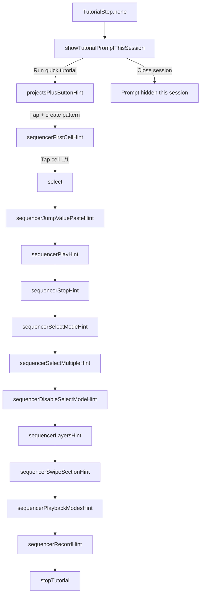
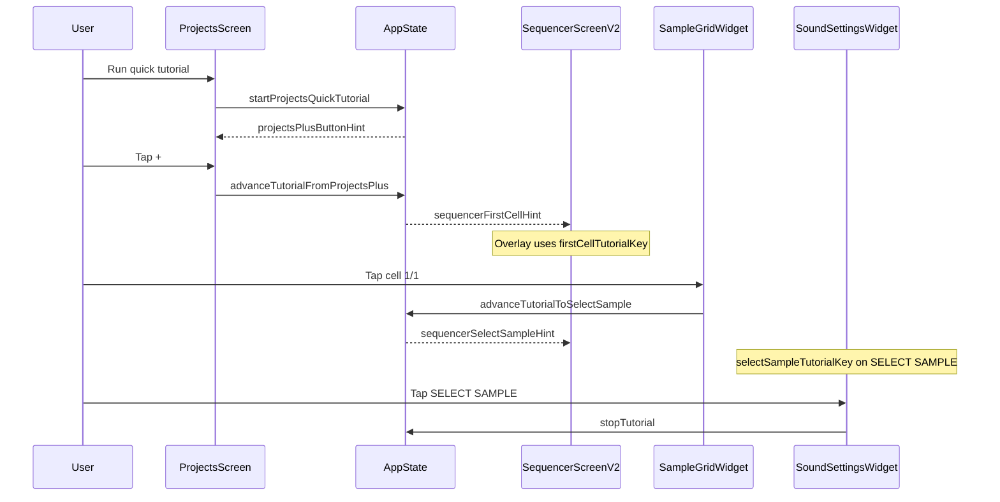

# First-launch tutorial flow

This document describes the in-app **quick tutorial** flow, current step order, and implementation map.

## Current status

- Tutorial runtime is intentionally **disabled** behind an internal flag:
  - `TutorialService.isEnabled = false` in `app/lib/services/tutorial_service.dart`.
- This keeps all tutorial code and steps documented/in-place while hiding it from users until finalized.
- Re-enable by switching the flag to `true`.

## Purpose (when enabled)

- On the **first app session** (persisted flag), show a prompt to **Run quick tutorial** with dismiss.
- Guide the user through Projects and Sequencer interactions using overlays, arrows, and verified actions.

## Persistence

| Key | Storage | Meaning |
|-----|---------|--------|
| `app_has_launched_before` | `ReliableStorage` (JSON prefs file) | After first `AppState.initialize()`, set to `true`. Used so the “first launch” prompt is only offered once across installs/sessions (see behavior below). |

**Session-only dismiss:** Tapping **close** on the initial prompt hides it for the **current app session** only; it does not write the persistence key back. Whether the prompt returns on the next cold start depends on whether `app_has_launched_before` was already set.

**Dev reset:** When the app is launched with `CLEAR_STORAGE` (e.g. `./run-ios.sh … clear`), local data is cleared and `app_has_launched_before` is removed so the flow can be tested again.

## State machine

`TutorialStep` in [`app/lib/services/tutorial_service.dart`](../../lib/services/tutorial_service.dart) drives which overlay is shown.

### User-visible steps (current 16-step order)

1. `projectsPlusButtonHint` - Tap `+` to create new pattern.
2. `sequencerFirstCellHint` - Press cell 1/1 in sample grid.
3. `sequencerSelectSampleHint` - Select sample for the cell.
4. `sequencerCopyPasteHint` - Copy and paste sample cell.
5. `sequencerDeleteHint` - Delete created sample cell.
6. `sequencerJumpHint` - Jump control explanation.
7. `sequencerJumpValuePasteHint` - Set Jump=2, copy once, paste several times.
8. `sequencerPlayHint` - Press Play and listen.
9. `sequencerStopHint` - Press Stop to stop playback.
10. `sequencerSelectModeHint` - Enter Select mode.
11. `sequencerSelectMultipleHint` - Select multiple cells.
12. `sequencerDisableSelectModeHint` - Disable Select mode.
13. `sequencerLayersHint` - Layers explanation (all 5 layers).
14. `sequencerSwipeSectionHint` - Swipe grid to create next section.
15. `sequencerPlaybackModesHint` - Loop/Song playback modes.
16. `sequencerRecordHint` - Recording step; tutorial completes after this.

## Sequence (user vs system)

## Implementation map

| Area | File(s) |
|------|---------|
| Tutorial state, keys, transitions, feature flag | [`lib/services/tutorial_service.dart`](../../lib/services/tutorial_service.dart) |
| App-level proxy to tutorial service | [`lib/state/app_state.dart`](../../lib/state/app_state.dart) |
| Provider registration + init + clear | [`lib/main.dart`](../../lib/main.dart) |
| Projects: prompt, + overlay, FAB navigation | [`lib/screens/projects_screen.dart`](../../lib/screens/projects_screen.dart) |
| Sequencer overlays (retry until anchor laid out) | [`lib/screens/sequencer_screen_v2.dart`](../../lib/screens/sequencer_screen_v2.dart) |
| Cell 1/1 key + tap advances tutorial | [`lib/widgets/sequencer/v2/sound_grid_widget.dart`](../../lib/widgets/sequencer/v2/sound_grid_widget.dart) |
| SELECT SAMPLE key + tap ends tutorial | [`lib/widgets/sequencer/v2/sound_settings.dart`](../../lib/widgets/sequencer/v2/sound_settings.dart) |

## Overlay behavior (summary)

- Overlays use **IgnorePointer** on scrim and decoration so the user can still tap targets (e.g. **+**, grid cell, **SELECT SAMPLE**).
- Arrows are **straight** segments to the **edge** of the target rect with a small inset, not necessarily the center.
- Sequencer anchors may attach **after** the first frame; the overlay layer **retries** until the `GlobalKey` has a size or a cap is reached.

## Extending the flow

Add new steps to `TutorialStep`, transitions in `TutorialService`, and matching overlay UI + `GlobalKey` anchors in the owning screen.
