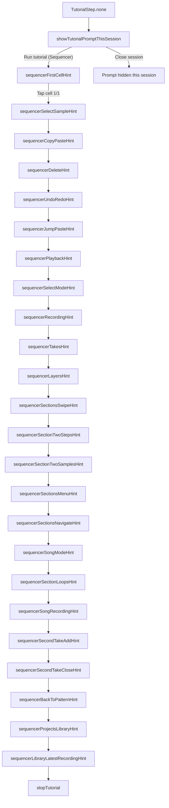
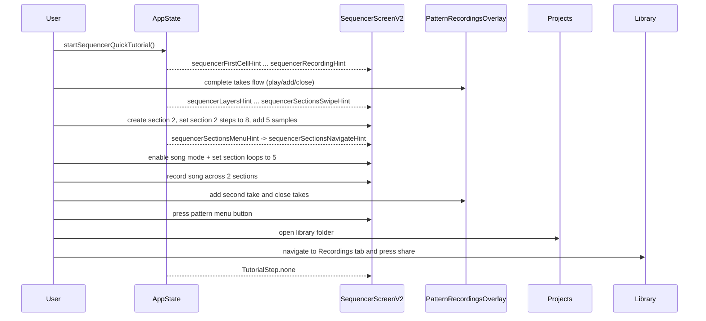

# First-launch tutorial flow

This document describes the in-app **quick tutorial** flow, current step order, and implementation map.

## Current status

- Tutorial runtime is controlled by internal flag `TutorialService.isEnabled` in `app/lib/services/tutorial_service.dart`.
- Tutorial overlays now show **label + counter + Back** (no Next button).
- Related tutorial actions are merged under shared step labels.

## Purpose (when enabled)

- On the **first app session** (persisted flag), show a small **Run tutorial** entry on the Sequencer (top-right of the sound grid area) with dismiss.
- Guide the user through Sequencer interactions using overlays, arrows, and verified actions.

## Persistence

| Key | Storage | Meaning |
|-----|---------|--------|
| `app_has_launched_before` | `ReliableStorage` (JSON prefs file) | After first `AppState.initialize()`, set to `true`. Used so the “first launch” prompt is only offered once across installs/sessions (see behavior below). |

**Session-only dismiss:** Tapping **close** on the initial prompt hides it for the **current app session** only; it does not write the persistence key back. Whether the prompt returns on the next cold start depends on whether `app_has_launched_before` was already set.

**Dev reset:** When the app is launched with `CLEAR_STORAGE` (e.g. `./run-ios.sh … clear`), local data is cleared and `app_has_launched_before` is removed so the flow can be tested again.

## State machine

`TutorialStep` in [`app/lib/services/tutorial_service.dart`](../../lib/services/tutorial_service.dart) drives which overlay is shown.

### User-visible steps (merged flow)

1. `sequencerFirstCellHint` + `sequencerSelectSampleHint` (`Select sample`) - Open cell 1/1 and select sample.
2. `sequencerCopyPasteHint` (`Copy paste`) - Copy and paste sample cell.
3. `sequencerDeleteHint` (`Delete`) - Delete created sample cell.
4. `sequencerUndoRedoHint` (`Undo redo`) - Press Undo then Redo.
5. `sequencerJumpPasteHint` (`Jump paste`) - Set Jump=2 and paste at least 3 times.
6. `sequencerPlaybackHint` (`Playback`) - Press Play, then Stop.
7. `sequencerSelectModeHint` (`Select mode`) - Enable Select, multi-select, then disable Select.
8. `sequencerRecordingHint` (`Recording`) - Start recording and then stop recording.
9. `sequencerTakesHint` (`Takes`) - Split into verified parts: (1) play take for >2s, (2) add to library, (3) close.
10. `sequencerLayersHint` (`Layers`) - Select layer tab, mute, unmute.
11. `sequencerSectionsSwipeHint` (`Sections swipe`) - Swipe to add a second section (verified when two sections exist); curved swipe hint on grid.
12. `sequencerSectionTwoStepsHint` (`Section 2 steps`) - In section settings, use + to increase **section 2** step count to **32** (verified via `getSectionStepCount(1) >= 32`).
13. `sequencerSectionTwoSamplesHint` (`Section 2 samples`) - Place samples in five cells in section 2 (any layers).
14. `sequencerSectionsMenuHint` (`Section menu`) - Open section chain / section management control.
15. `sequencerSectionsNavigateHint` (`Navigate sections`) - Swipe right back to section 1 (verified when UI section index is 0).
16. `sequencerSongModeHint` (`Song mode`) - Toggle from loop to song mode.
17. `sequencerSectionLoopsHint` (`Section loops`) - Set loops count to **5** for any section (verified when any loop value is 5).
18. `sequencerSongRecordingHint` (`Song recording`) - Press Record, then Play, and stop recording after song playback (requires song mode and >=2 sections).
19. `sequencerSecondTakeAddHint` + `sequencerSecondTakeCloseHint` (`Second take`) - Two parts: (1) add the second take (2-section song take) to library, then (2) close Takes again.
20. `sequencerBackToPatternHint` (`Pattern menu`) - Press Pattern menu button to return to the patterns page.
21. `sequencerProjectsLibraryHint` (`Library folder`) - On patterns page, press the Library folder icon.
22. `sequencerLibraryLatestRecordingHint` (`Library overview`) - Three parts in Library: (1) read overview and navigate to **Recordings** tab if needed, (2) press **Share** for the latest recording, (3) final thank-you message.

## Sequence (high level)

## Implementation map

| Area | File(s) |
|------|---------|
| Tutorial state, keys, transitions, feature flag | [`lib/services/tutorial_service.dart`](../../lib/services/tutorial_service.dart) |
| App-level proxy to tutorial service | [`lib/state/app_state.dart`](../../lib/state/app_state.dart) |
| Provider registration + init + clear | [`lib/main.dart`](../../lib/main.dart) |
| Sequencer tutorial entry + overlays (retry until anchor laid out) | [`lib/screens/sequencer_screen_v2.dart`](../../lib/screens/sequencer_screen_v2.dart) |
| Section settings arrows (loops + steps controls) | [`lib/widgets/sequencer/v2/section_settings_widget.dart`](../../lib/widgets/sequencer/v2/section_settings_widget.dart) |
| Song/loop + section settings anchors (left controls) | [`lib/widgets/sequencer/v2/sound_grid_side_control_widget.dart`](../../lib/widgets/sequencer/v2/sound_grid_side_control_widget.dart) |
| Cell 1/1 key + tap advances tutorial | [`lib/widgets/sequencer/v2/sound_grid_widget.dart`](../../lib/widgets/sequencer/v2/sound_grid_widget.dart) |
| Takes overlay guidance and second-take add completion | [`lib/widgets/pattern_recordings_overlay.dart`](../../lib/widgets/pattern_recordings_overlay.dart) |
| SELECT SAMPLE key + sample-step completion | [`lib/widgets/sequencer/v2/sound_settings.dart`](../../lib/widgets/sequencer/v2/sound_settings.dart) |

## Overlay behavior (summary)

- Tutorial text is centered in the sound-grid area by default (unless a step uses explicit alternate anchoring).
- Overlays use dimmed backgrounds and step-scoped interaction gating so only required controls for the current step are interactive.
- Every tutorial text card includes **Back** and **Quit tutorial** actions.
- Arrows are edge-targeted coach-mark pointers; section swipe uses a **curved swipe hint** across the sound grid.
- Sequencer anchors may attach **after** the first frame; the overlay layer **retries** until the `GlobalKey` has a size or a cap is reached.

## Extending the flow

Add new steps to `TutorialStep`, transitions in `TutorialService`, and matching overlay UI + `GlobalKey` anchors in the owning screen.
